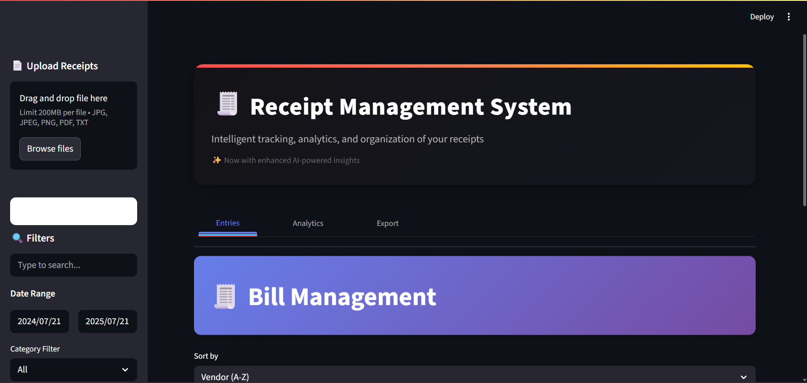
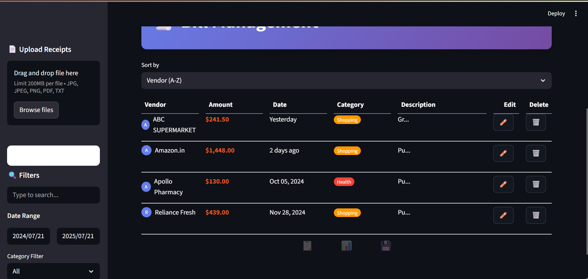
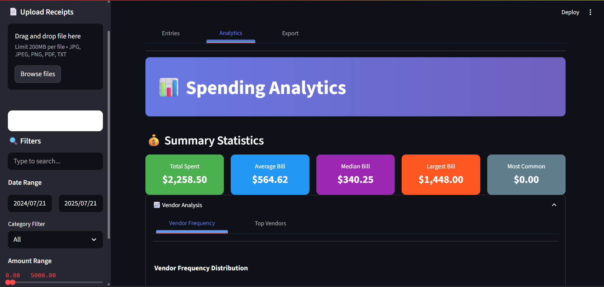
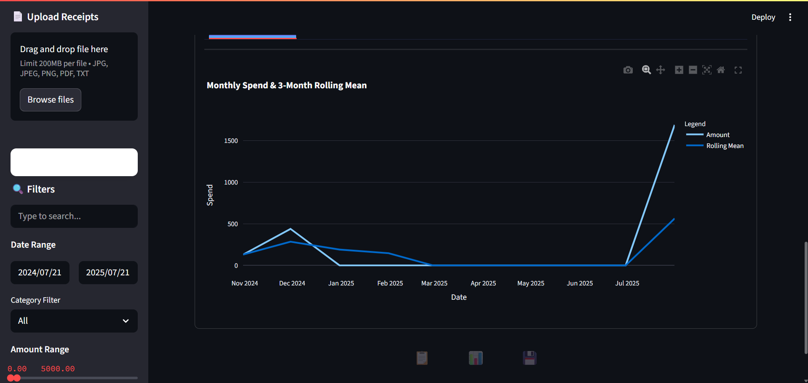
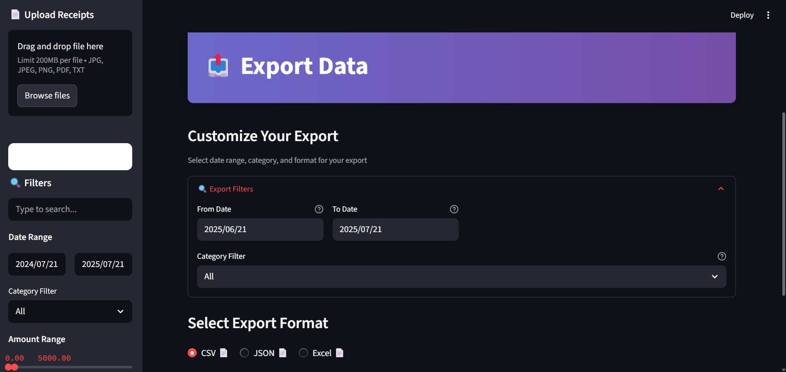
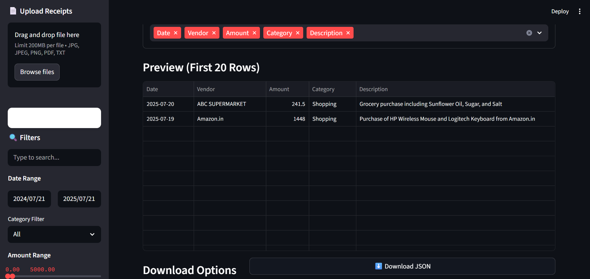

# 📋 Receipt Management System

[](https://opensource.org/licenses/MIT)
[](https://www.python.org/)
[](https://streamlit.io/)

A full-stack web-based application for managing receipts and expenses, built with *Streamlit* and *SQLAlchemy*. This tool allows users to upload, store, categorize, update, delete, and analyze bills efficiently with support for file attachments and advanced analytics.

## ✨ Key Features

- *Bill Management*
  - Upload bills with metadata and associated file reference
  - View, update, and delete existing bills and vendors
  - Advanced search with date/amount/category filters
  - Hashed indexing for fast lookups

- *Analytics Dashboard*
  - Monthly trend analysis with category-wise breakdowns
  - Calculates total spent, average bill, median, largest bill
  - Identifies top vendors and spending frequency

- *Data Export*
  - Export bills to CSV, Excel, and JSON formats
  - Custom filters for downloading specific data subsets

- *Vendor Management*
  - Categorize vendors by expense type
  - Edit or delete vendor details
  - Automatic vendor classification


## 🛠 Technology Stack

- *Frontend*: Streamlit (Interactive UI)
- *Backend*: 
  - SQLAlchemy ORM + SQLite
  - Python 3.8+
  - LangChain (for AI features)
- *Data Processing*:
  - Pandas + NumPy
  - Pydantic (Data validation)
- *Visualization*: Streamlit native charts

## 📦 Installation & Setup

1. *Clone the repository*
```bash
git clone https://github.com/Sabari2005/receipt-manager.git
cd receipt-manager
```

2. *Set up virtual environment (recommended)*
```bash
    python -m venv venv
    source venv/bin/activate  # Windows: venv\Scripts\activate
```

3. *Install dependencies*

```bash
pip install -r requirements.txt
```

4. *Initialize database*
```bash
python models.py
```

5. *Launch the application*
```bash
streamlit run app.py
```

## 📂 Directory Structure

```bash
.
├── app.py              # Streamlit main application
├── service_layer.py    # Business logic, AI/OCR, search/sort
├── db_handler.py       # Database operations (SQLAlchemy)
├── models.py           # Data models (Pydantic + SQLAlchemy)
├── requirements.txt    # Python dependencies
├── .env.example        # Environment variables template
├── data/               # Database and uploaded files
├── screenshots/        # Application screenshots
└── README.md           # This documentation
```

## 📊 Vendor Categories

The system supports these default expense categories:
- 🍔 Food
- 🚗 Transport
- 💡 Utilities
- 🎬 Entertainment
- 🛒 Shopping
- 💊 Health
- 🏷 Other

## 🖥 Screenshots

<div align="center">
  
  
  
  
  
  
</div>


## ▶ Video Demonstration

[](https://drive.google.com/file/d/1UzIFDXUsun4z28ULbQ4ZZBXRs_juyVuX/view?usp=sharing)

## 🌐 Live Demo

Experience the app directly: [Live Demo]([https://your-streamlit-app-url.streamlit.app/](https://receipt-manager-sabari-aiml.streamlit.app/))


## 📄 License

Distributed under the MIT License. See LICENSE for more information.

## 📧 Contact

## Author

- Sabari Vadivelan S - Contact Gmail [sabari132005@gmail.com]()

Project Link: [https://github.com/sabari2005/receipt-manager](https://github.com/yourusername/receipt-manager)
